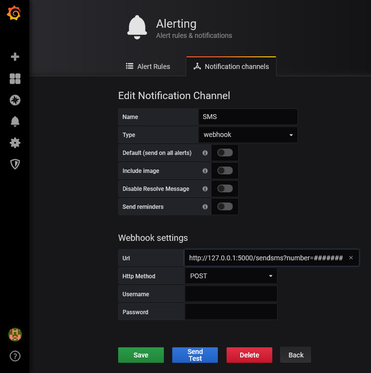

# AWS-SNS-SMS-Webhook

A custom webhook for Grafana that can be used to create a SMS alert channel.

This script was created for my Grafana tutorials at https://sbcode.net/grafana/sms-alert-channel/

It uses Flask and Boto3

You will need to create a IAM user in AWS, and copy it's access key and secret to the `sendsms.py` script

Install and run this script on your Grafana server.

Ubuntu 18.04
```bash
sudo apt install python-pip
pip install flask boto3
python sendsms.py
```

Output
```bash
root@grafana:~# python sendsms.py
 * Serving Flask app "sendsms" (lazy loading)
 * Environment: production
   WARNING: This is a development server. Do not use it in a production deployment.
   Use a production WSGI server instead.
 * Debug mode: off
 * Running on http://127.0.0.1:5000/ (Press CTRL+C to quit)
```

Go into the Grafana UI

Select **Alerting**-->**Notification Channels** and add a **New Channel**

Key | Value
-- | --
Name | SMS
Type | webhook
Url  | http://127.0.0.1:5000/sendsms?number=**your telephone number**
Http Method | POST

> :warning: In the above table, the telephone number added to the URL should be in E.164 format but without the + symbol. 
  eg. Country code +44, with mobile number 07700 900123 should be written as 44700900123. 
  So the URL would now be http://127.0.0.1:5000/sendsms?number=44700900123 

Now press the **Send Test** button. You should get an SMS on your mobile telephone.

